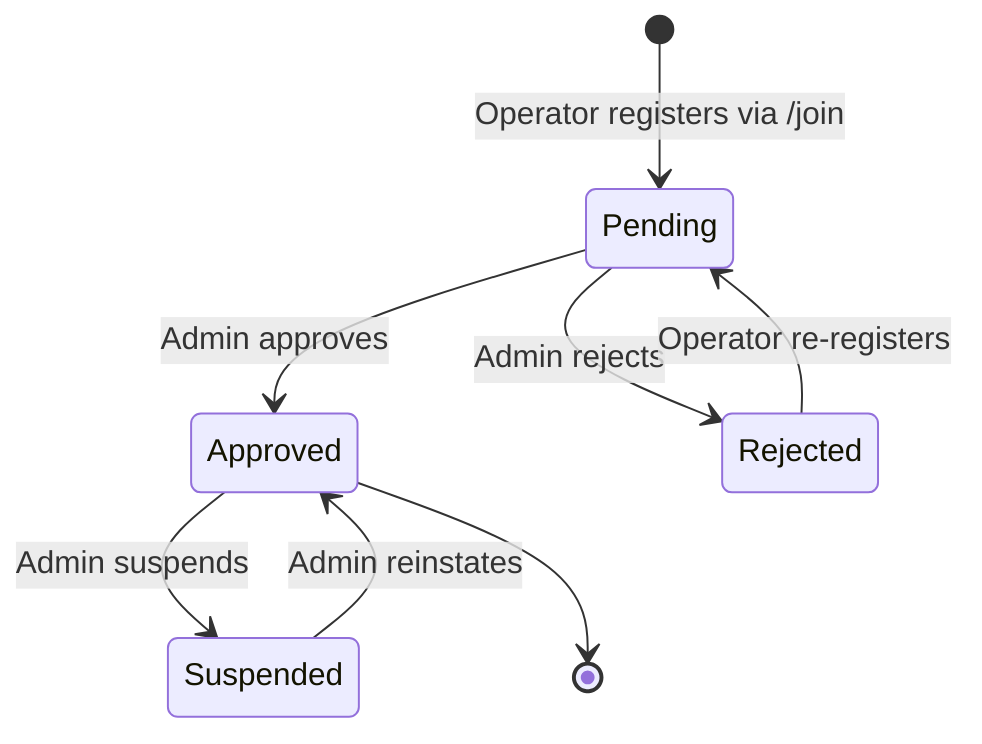

# Business Rules

## 1. Operator Status Workflow

**Rules:**
- New registrations default to `status = 'pending'`
- Only `approved` operators appear in public browse/search results
- `suspended` operators' profiles are hidden from public
- `rejected` operators are hidden; can re-register with new info
- Status changes are recorded via `updated_at` timestamp (no separate audit log)

---

## 2. Authentication Rules

| Rule | Description |
|------|-------------|
| AR-01 | Google OAuth is available to anyone with a Google account |
| AR-02 | Email OTP: valid email required, OTP expires after 10 minutes |
| AR-03 | WhatsApp OTP: valid phone number required, OTP expires after 10 minutes |
| AR-04 | OTP is 6 digits, stored as TEXT |
| AR-05 | OTP verification attempts: `attempts` column exists but no explicit max in verify routes |
| AR-06 | Session expires with JWT token lifetime (NextAuth default: 30 days) |
| AR-07 | Stale/invalid sessions (missing `operator_id`) are detected on login page and cleaned via `signOut()` |
| AR-08 | Admin is identified by hardcoded email `nadeemkolu22@gmail.com` in auth callbacks |
| AR-09 | Only one active session per user (JWT strategy — no session store) |

---

## 3. Lead Capture Rules

| Rule | Description |
|------|-------------|
| LR-01 | Any visitor (authenticated or not) can submit a lead |
| LR-02 | Lead requires `operator_id` and `session_id` (from `x-session-id` header or auto-generated) |
| LR-03 | `session_id` is a client-generated UUID stored in localStorage to identify anonymous visitors |
| LR-04 | One lead submission = one row; no deduplication |
| LR-05 | `source` field tracks where the lead was submitted from: `'profile'`, `'qr'`, or `'search'` |
| LR-06 | Leads are visible to the operator who received them |
| LR-07 | **ENFORCED:** Free plan allows 3 leads/month; code checks count against `lead_month` counter |
| LR-08 | **NOT ENFORCED:** Pro plan has unlimited leads; no code differentiates beyond plan name |

---

## 4. Profile Completion Score (Client-Side Logic)

The dashboard calculates a completion percentage based on filled fields:

| Field | Weight | Notes |
|-------|--------|-------|
| `name` | 12.5% | Must be non-empty |
| `short_desc` | 12.5% | Must be non-empty |
| `long_desc` | 12.5% | Must be non-empty |
| `photos` | 12.5% | Array must have at least 1 element |
| `tariffs` | 12.5% | Must be non-null (even if empty object) |
| `category_details` | 12.5% | Must have corresponding `*_details` JSONB (houseboat_details for houseboat category, etc.) |
| `lat` | 12.5% | Must be non-null |
| `lng` | 12.5% | Must be non-null |

**Formula:** `(filled_fields / 8) * 100`

---

## 5. Slug Generation Rules

| Rule | Description |
|------|-------------|
| SR-01 | Slug is auto-generated from the operator's name |
| SR-02 | Generation: lowercase, replace spaces with hyphens, remove special chars, append random suffix if needed |
| SR-03 | Slug must be unique (enforced by DB unique index) |
| SR-04 | Slug is set on creation and editable by the operator |
| SR-05 | URL pattern: `/o/[slug]` |
| SR-06 | Slugs can contain: lowercase letters, numbers, hyphens |

---

## 6. Geospatial Rules

| Rule | Description |
|------|-------------|
| GR-01 | Lat/Lng are stored as `DOUBLE PRECISION` (WGS84 coordinate system) |
| GR-02 | Search radius is hardcoded at 10,000m (10km) when "Near Me" is active |
| GR-03 | Distance calculation uses PostgreSQL earthdistance extension (`ll_to_earth`) |
| GR-04 | Operators with NULL lat/lng are excluded from geospatial queries |
| GR-05 | Geospatial index (`operators_earth_idx`) requires lat/lng to be non-null |
| GR-06 | Multiple operators at same coordinates are allowed (no unique constraint on lat/lng) |

---

## 7. Photo Upload Rules

| Rule | Description |
|------|-------------|
| PR-01 | Photos are uploaded via `POST /api/upload/photo` (multipart form data) |
| PR-02 | Server uploads buffer to Cloudinary, returns `{ url, key }` |
| PR-03 | Max photo count: 5 (enforced client-side in edit page) |
| PR-04 | Photo deletion: not implemented (no remove button in edit page) |
| PR-05 | Photo validation: MIME type (jpeg/png/webp) and size (max 5MB) enforced server-side |
| PR-06 | Client-side compression via `browser-image-compression` before upload |

---

## 8. Admin Privileges

| Rule | Description |
|------|-------------|
| AR-01 | Admin is identified by hardcoded email: `nadeemkolu22@gmail.com` |
| AR-02 | Admin can view all operators regardless of status |
| AR-03 | Admin can change operator status, verify, change plan, reset lead counters (via POST actions) |
| AR-04 | Admin actions: `approve`, `reject`, `suspend`, `verify`, `change_plan`, `reset_leads` |
| AR-05 | Route protection is dual: `proxy.ts` middleware + client-side `is_admin` check |

---

## 9. Category-Specific Rules

### Houseboat
- `houseboat_details` JSONB structure:
  - `owner`, `address`, `contact`, `contact2`, `email`, `grade`
  - `google_maps`, `latitude`, `longitude`
  - `boat_ghat`, `boat_ghat_lat`, `boat_ghat_lng`

### Shikara
- `shikara_details` JSONB structure:
  - `full_name`, `mobile_number`, `whatsapp_number`, `shikara_number`, `ghat_number`
  - `operating_areas[]`, `years_experience`, `languages[]`, `services[]`
  - `tour_duration`, `registered_shikara`, `registration_number`

### Artisan
- `artisan_details` JSONB structure:
  - `business_type`, `specialties[]`, `business_scale`
  - `owner_name`, `contact_number`, `whatsapp_number`, `email_address`
  - `website`, `gst_number`, `export_license`, `years_in_business`, `google_maps`

### Guide & Vendor
- No specific `guide_details` or `vendor_details` JSONB column

---

## 10. Plan / Billing Rules (NOT ENFORCED)

| Rule | Description | Enforced? |
|------|-------------|-----------|
| BR-01 | Free plan: 3 leads/month | ✅ Yes |
| BR-02 | Pro plan: unlimited leads | ❌ No payment integration |
| BR-03 | `lead_month` resets monthly | ❌ No cron/reset job (calculated dynamically) |
| BR-04 | Profile visibility is same for free and pro | ❌ No differentiation |

---

## 11. Data Validation Rules

| Field | Rule |
|-------|------|
| `name` | Required, min 2 characters |
| `whatsapp` | Required, valid phone format (must include country code) |
| `category` | Required, must be one of 5 valid categories |
| `slug` | Auto-generated from name, must be unique |
| `short_desc` | Max 500 characters |
| `long_desc` | Max 2000 characters |
| `email` | Optional, valid email format if provided |
| `photos` | MIME type jpeg/png/webp, max 5MB per file, max 5 photos |
| `lat` | Range: -90 to 90 |
| `lng` | Range: -180 to 180 |

---

## 12. Privacy & Data Rules

| Rule | Description |
|------|-------------|
| PDR-01 | Visitor sessions are tracked via `session_id` stored in localStorage (not cookies) |
| PDR-02 | Phone numbers are visible on public profiles (WhatsApp deep link) |
| PDR-03 | No user consent banner / GDPR notice |
| PDR-04 | No cookie consent mechanism |
| PDR-05 | Lead data is stored indefinitely — no retention policy |
| PDR-06 | No data deletion endpoint for operators or visitors |

---

## 13. Error Handling Rules

| Scenario | Behavior |
|----------|----------|
| API returns 4xx/5xx | Toast notification with error message (sonner) |
| Network offline | No explicit offline handling (PWA offline page at `/offline`) |
| Invalid slug | 404 page |
| Session expired | Redirect to login, attempt to clear stale session |
| OTP expired | User must request new OTP |
| OTP wrong | Increment `attempts` counter, show "Invalid OTP" |
| Photo upload fails | Return 500 with error message |
| Free plan lead limit hit | Return `{ blocked: true }`, operator profile shows "Blocked" state |
