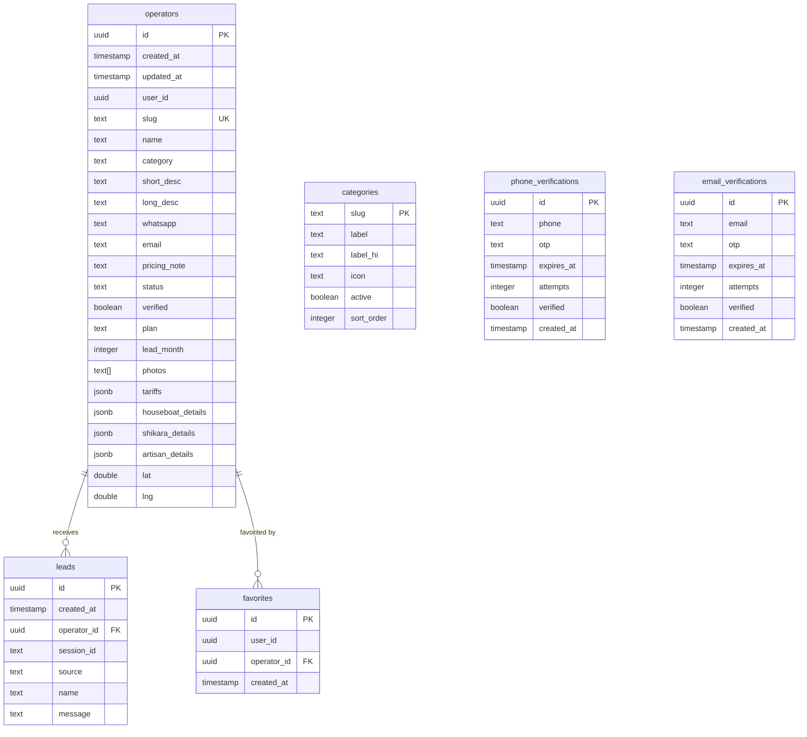

# Database Schema

**Platform:** Neon (Serverless PostgreSQL 16)  
**Driver:** `@neondatabase/serverless`  
**ORM:** Drizzle ORM v0.45.2  
**Files:** `src/db/schema.ts` (Drizzle definitions), `src/db/migrate.ts` (raw SQL DDL)

---

## 1. Table: `operators`

**Primary table** — stores all operator profiles.

| Column | Type | Constraints | Default | Description |
|--------|------|-------------|---------|-------------|
| `id` | `UUID` | `PRIMARY KEY` | `gen_random_uuid()` | Unique identifier |
| `created_at` | `TIMESTAMPTZ` | | `now()` | Row creation timestamp |
| `updated_at` | `TIMESTAMPTZ` | | `now()` | Last update timestamp |
| `user_id` | `UUID` | | `NULL` | Links to NextAuth user (if applicable) |
| `slug` | `TEXT` | `NOT NULL`, `UNIQUE` | | URL-friendly identifier (e.g., "kashmir-houseboats-1") |
| `name` | `TEXT` | `NOT NULL` | | Display name / business name |
| `category` | `TEXT` | `NOT NULL`, `CHECK (category IN ('houseboat','shikara','artisan','guide','vendor'))` | | Operator category |
| `short_desc` | `TEXT` | `CHECK (char_length(short_desc) <= 500)` | `NULL` | Brief description (~2-3 sentences) |
| `long_desc` | `TEXT` | `CHECK (char_length(long_desc) <= 2000)` | `NULL` | Detailed description |
| `whatsapp` | `TEXT` | `NOT NULL` | | WhatsApp phone number (with country code) |
| `email` | `TEXT` | | `NULL` | Email address (added via migration, not in original schema) |
| `pricing_note` | `TEXT` | | `NULL` | Free-form pricing info |
| `status` | `TEXT` | `DEFAULT 'pending'`, `CHECK (status IN ('pending','approved','rejected','suspended'))` | `'pending'` | Moderation status |
| `verified` | `BOOLEAN` | `DEFAULT false` | `false` | Verification badge |
| `plan` | `TEXT` | `DEFAULT 'free'`, `CHECK (plan IN ('free','pro'))` | `'free'` | Subscription tier (not enforced) |
| `lead_month` | `INTEGER` | `DEFAULT 0` | `0` | Leads used this month (INFERRED — not decremented in code) |
| `photos` | `TEXT[]` | | `NULL` | Array of Cloudinary URLs |
| `tariffs` | `JSONB` | | `NULL` | Pricing table (key-value pairs) |
| `houseboat_details` | `JSONB` | | `NULL` | Houseboat-specific fields (rooms, amenities, etc.) |
| `shikara_details` | `JSONB` | | `NULL` | Shikara-specific fields (routes, durations, etc.) |
| `artisan_details` | `JSONB` | | `NULL` | Artisan-specific fields (craft type, materials, etc.) |
| `lat` | `DOUBLE PRECISION` | | `NULL` | Latitude (for geospatial search) |
| `lng` | `DOUBLE PRECISION` | | `NULL` | Longitude (for geospatial search) |

**Indexes:**
| Index Name | Type | Columns | Description |
|-----------|------|---------|-------------|
| `operators_slug_idx` | `UNIQUE` B-tree | `slug` | Enforce slug uniqueness |
| `operators_category_status_idx` | B-tree | `category, status` | Filter operators by category + status |
| `operators_search_idx` | GIN | `to_tsvector('english', coalesce(name,'') \|\| ' ' \|\| coalesce(short_desc,'') \|\| ' ' \|\| coalesce(long_desc,''))` | Full-text search across name and descriptions |
| `operators_earth_idx` | GiST | `ll_to_earth(lat, lng)` | Geospatial distance queries |

**Extensions Required:**
- `pg_trgm` (trigram text search — INFERRED for fuzzy search support)
- `cube` (dependency for earthdistance)
- `earthdistance` (geospatial distance calculation)

---

## 2. Table: `leads`

**Lead tracking** — stores contact requests from visitors to operators.

| Column | Type | Constraints | Default | Description |
|--------|------|-------------|---------|-------------|
| `id` | `UUID` | `PRIMARY KEY` | `gen_random_uuid()` | Unique identifier |
| `created_at` | `TIMESTAMPTZ` | | `now()` | Submission timestamp |
| `operator_id` | `UUID` | `REFERENCES operators(id) ON DELETE CASCADE` | `NULL` | Target operator |
| `session_id` | `TEXT` | `NOT NULL` | | Anonymous visitor session |
| `source` | `TEXT` | | `'profile'` | Lead source (profile, browse, etc.) |
| `name` | `TEXT` | | `NULL` | Visitor's name |
| `message` | `TEXT` | | `NULL` | Visitor's message |

**Indexes:**
| Index Name | Type | Columns | Description |
|-----------|------|---------|-------------|
| `leads_operator_created_idx` | B-tree | `operator_id, created_at DESC` | Fast lead queries per operator, sorted by date |

---

## 3. Table: `categories`

**Category definitions** — static reference data.

| Column | Type | Constraints | Default | Description |
|--------|------|-------------|---------|-------------|
| `slug` | `TEXT` | `PRIMARY KEY` | | Category identifier (e.g., 'houseboat') |
| `label` | `TEXT` | `NOT NULL` | | English label (e.g., 'Houseboats') |
| `label_hi` | `TEXT` | | `NULL` | Hindi label (for i18n — not used) |
| `icon` | `TEXT` | | `NULL` | Icon identifier (e.g., 'IconHome') |
| `active` | `BOOLEAN` | `DEFAULT true` | `true` | Whether category is active |
| `sort_order` | `INTEGER` | `DEFAULT 0` | `0` | Display order |

**Seed Data (from migration):**

| slug | label | icon | sort_order |
|------|-------|------|------------|
| houseboat | Houseboats | IconHome | 1 |
| shikara | Shikara Rides | IconSailboat | 2 |
| artisan | Artisans & Crafts | IconPalette | 3 |
| guide | Local Guides | IconMapPin | 4 |
| vendor | Floating Vendors | IconShoppingBag | 5 |

---

## 4. Table: `favorites`

**User favorites** — stores visitor favorite operators.

| Column | Type | Constraints | Default | Description |
|--------|------|-------------|---------|-------------|
| `id` | `UUID` | `PRIMARY KEY` | `gen_random_uuid()` | Unique identifier |
| `user_id` | `UUID` | `NOT NULL` | | User who favorited |
| `operator_id` | `UUID` | `REFERENCES operators(id) ON DELETE CASCADE` | | Favorited operator |
| `created_at` | `TIMESTAMPTZ` | | `now()` | Timestamp |

**Constraints:**
- `UNIQUE(user_id, operator_id)` — prevents duplicate favorites

---

## 5. Table: `phone_verifications`

**WhatsApp OTP storage** — stores OTP codes sent via WhatsApp.

| Column | Type | Constraints | Default | Description |
|--------|------|-------------|---------|-------------|
| `id` | `UUID` | `PRIMARY KEY` | `gen_random_uuid()` | Unique identifier |
| `phone` | `TEXT` | `NOT NULL` | | Phone number (with country code) |
| `otp` | `TEXT` | `NOT NULL` | | 6-digit OTP code |
| `expires_at` | `TIMESTAMPTZ` | `NOT NULL` | | OTP expiration timestamp |
| `attempts` | `INTEGER` | `DEFAULT 0` | `0` | Verification attempts |
| `verified` | `BOOLEAN` | `DEFAULT false` | `false` | Whether OTP was verified |
| `created_at` | `TIMESTAMPTZ` | | `now()` | Row creation timestamp |

---

## 6. Table: `email_verifications`

**Email OTP storage** — stores OTP codes sent via Resend email.

| Column | Type | Constraints | Default | Description |
|--------|------|-------------|---------|-------------|
| `id` | `UUID` | `PRIMARY KEY` | `gen_random_uuid()` | Unique identifier |
| `email` | `TEXT` | `NOT NULL` | | Email address |
| `otp` | `TEXT` | `NOT NULL` | | 6-digit OTP code |
| `expires_at` | `TIMESTAMPTZ` | `NOT NULL` | | OTP expiration timestamp |
| `attempts` | `INTEGER` | `DEFAULT 0` | `0` | Verification attempts |
| `verified` | `BOOLEAN` | `DEFAULT false` | `false` | Whether OTP was verified |
| `created_at` | `TIMESTAMPTZ` | | `now()` | Row creation timestamp |

---

## 7. Drizzle Schema Definition (`src/db/schema.ts`)

```typescript
// INFERRED STRUCTURE (from import usage across the codebase)
// The actual schema.ts file uses `pgTable`, `uuid`, `text`, `boolean`,
// `timestamp`, `integer`, `jsonb`, `doublePrecision`, `primaryKey()`,
// `defaultNow()`, `uniqueIndex()`, `index()`, `Check` constraints

import { pgTable, uuid, text, boolean, timestamp, integer, jsonb, doublePrecision, index, uniqueIndex } from 'drizzle-orm/pg-core';

export const operators = pgTable('operators', {
  id: uuid('id').defaultRandom().primaryKey(),
  createdAt: timestamp('created_at', { withTimezone: true }).defaultNow(),
  updatedAt: timestamp('updated_at', { withTimezone: true }).defaultNow(),
  userId: uuid('user_id'),
  slug: text('slug').notNull().unique(),
  name: text('name').notNull(),
  category: text('category').notNull(),
  shortDesc: text('short_desc'),
  longDesc: text('long_desc'),
  whatsapp: text('whatsapp').notNull(),
  email: text('email'),
  pricingNote: text('pricing_note'),
  status: text('status').default('pending'),
  verified: boolean('verified').default(false),
  plan: text('plan').default('free'),
  leadMonth: integer('lead_month').default(0),
  photos: text('photos').array(),
  tariffs: jsonb('tariffs'),
  houseboatDetails: jsonb('houseboat_details'),
  shikaraDetails: jsonb('shikara_details'),
  artisanDetails: jsonb('artisan_details'),
  lat: doublePrecision('lat'),
  lng: doublePrecision('lng'),
}, (table) => ({
  slugIdx: uniqueIndex('operators_slug_idx').on(table.slug),
  categoryStatusIdx: index('operators_category_status_idx').on(table.category, table.status),
  searchIdx: index('operators_search_idx').using('gin', ...),
  earthIdx: index('operators_earth_idx').using('gist', ...),
}));

export const leads = pgTable('leads', {
  id: uuid('id').defaultRandom().primaryKey(),
  createdAt: timestamp('created_at', { withTimezone: true }).defaultNow(),
  operatorId: uuid('operator_id').references(() => operators.id, { onDelete: 'cascade' }),
  sessionId: text('session_id').notNull(),
  source: text('source').default('profile'),
  name: text('name'),
  message: text('message'),
});
```

---

## 8. Entity Relationship Diagram



---

## 9. Migration Notes

- Migration is run via raw SQL (`src/db/migrate.ts`) using `@neondatabase/serverless`, NOT via Drizzle Kit migrations
- Several columns were added via `ALTER TABLE ADD COLUMN IF NOT EXISTS` in the migration script (not in the initial CREATE TABLE):
  - `tariffs` (JSONB)
  - `houseboat_details` (JSONB)
  - `shikara_details` (JSONB)
  - `artisan_details` (JSONB)
  - `lat` (DOUBLE PRECISION)
  - `lng` (DOUBLE PRECISION)
  - `email` (TEXT)
- The migration also backfills `email` for existing operators where `email IS NULL` using: `lower(regexp_replace(whatsapp, '\D', '', 'g')) || '@nadur.com'`
- Drizzle Kit is configured (`drizzle.config.ts`) for schema generation but the primary migration path is the raw SQL script
- **REQUIRES VERIFICATION:** Drizzle schema (`schema.ts`) may be out of sync with actual DB state since raw ALTER TABLE commands were run outside Drizzle's tracking

---

## 10. Common Queries

```sql
-- Browse: all approved operators with full-text search
SELECT * FROM operators
WHERE status = 'approved'
  AND to_tsvector('english', name || ' ' || short_desc || ' ' || long_desc)
      @@ plainto_tsquery('english', 'search terms')
ORDER BY created_at DESC;

-- Browse: geospatial filter within 5km radius
SELECT * FROM operators
WHERE status = 'approved'
  AND earth_distance(ll_to_earth(lat, lng), ll_to_earth(34.09, 74.79)) <= 5000;

-- Admin: operators with lead counts
SELECT o.*, COUNT(l.id) as lead_count
FROM operators o
LEFT JOIN leads l ON l.operator_id = o.id
GROUP BY o.id
ORDER BY lead_count DESC;

-- Leads for a specific operator
SELECT * FROM leads
WHERE operator_id = 'some-uuid'
ORDER BY created_at DESC
LIMIT 50;

-- Profile completion score (application-level logic)
-- Fields: name, short_desc, long_desc, photos (non-empty), tariffs, category_details, lat, lng
-- Each field contributes ~12.5% to a 100% scale
```
