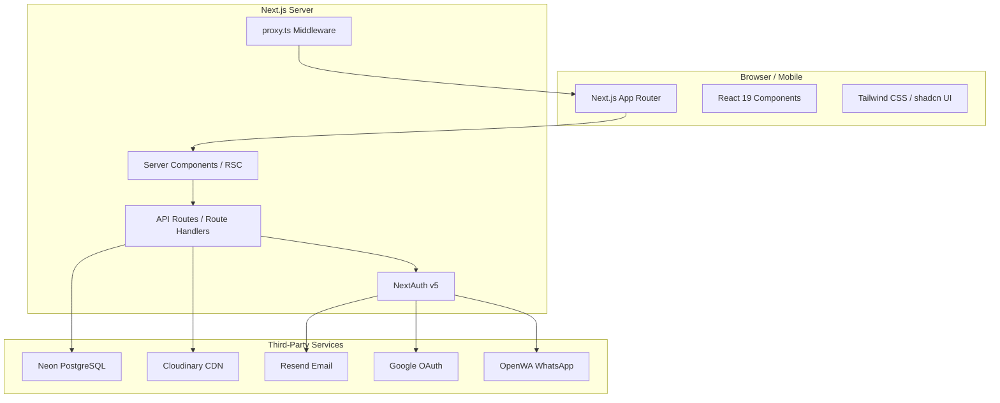

# Nadurr — Project Overview

> **Codename:** `nadur-temp` (package.json)  
> **Version:** 0.1.0  
> **Status:** Pre-alpha / Active Development  

---

## 1. What Is Nadurr?

Nadurr is a **SaaS directory platform** that connects tourists and locals with service providers on and around Dal Lake, Srinagar, Kashmir. It serves as a unified discovery, lead-generation, and communication bridge for five categories of operators:

| Category     | Description                          |
|-------------|--------------------------------------|
| Houseboat   | Owners of houseboats (accommodation) |
| Shikara     | Shikara ride operators               |
| Artisan     | Handicraft artisans & craftspeople   |
| Guide       | Local tour guides                    |
| Vendor      | Floating market vendors              |

Each operator gets a **public profile page** with photos, contact info, pricing, and a lead-capture form. The platform uses **geospatial search** (Near Me) to help users find operators nearby and **WhatsApp link** for direct chat.

---

## 2. Core Features

### For Visitors (UnAuthenticated)
- Browse operators by category
- Full-text search by name/description
- Geospatial "Near Me" filtering (radius-based)
- View detailed operator profiles with photo galleries
- Click-to-WhatsApp contact
- View pricing/tariffs (houseboat/shikara)
- Submit leads (contact requests) — tracked per session

### For Operators (Authenticated)
- Dashboard with profile completion score and lead statistics
- Edit own profile (name, description, photos, pricing, contact info)
- Category-specific fields (houseboat_details, shikara_details, artisan_details)
- Upload photos via API route to Cloudinary
- View leads received

### For Admin
- View all operators in a master list
- Approve/reject/suspend operator registrations
- Verify/unverify operators, change plans, reset lead counters
- Hardcoded admin: nadeemkolu22@gmail.com

---

## 3. Tech Stack

| Layer        | Technology                                   |
|-------------|----------------------------------------------|
| Framework   | Next.js 16.2.9 (App Router, React 19.2.4)   |
| Language    | TypeScript 5.8                               |
| Styling     | Tailwind CSS 4.1.x                           |
| UI          | shadcn/ui (Radix primitives + class-variance-authority) |
| Database    | Neon (Serverless PostgreSQL)                 |
| ORM         | Drizzle ORM 0.45.2                           |
| Auth        | NextAuth v5 beta (@auth/core 0.41.2)        |
| Email       | Resend                                       |
| File Upload | Cloudinary (via custom API route)            |
| Icons       | Lucide React                                 |
| Storage     | S3-compatible (credentials in env, unused)   |
| Linting     | ESLint 9.x (flat config)                     |
| WhatsApp    | OpenWA (self-hosted gateway)                 |

---

## 4. Directory Structure

```
nadur/
├── .env / .env.example            # Environment variables
├── next.config.ts                 # Next.js config (images, experimental)
├── drizzle.config.ts              # Drizzle ORM config (Neon connection)
├── tsconfig.json                  # TypeScript config (strict mode, path aliases)
├── package.json                   # Dependencies & scripts
├── eslint.config.mjs              # ESLint flat config
├── postcss.config.mjs             # PostCSS (Tailwind v4)
├── docker-compose.openwa.yml      # OpenWA WhatsApp gateway
│
├── public/                        # Static assets (favicon, manifest, icons)
│
├── src/
│   ├── proxy.ts                   # Route guard for /admin and /portal
│   │
│   ├── app/                       # Next.js App Router pages
│   │   ├── layout.tsx             # Root layout (SessionProvider, fonts)
│   │   ├── page.tsx               # Browse page (home)
│   │   ├── globals.css            # Tailwind directives + custom CSS
│   │   ├── not-found.tsx          # 404 page
│   │   │
│   │   ├── o/[slug]/              # /o/[slug] — public operator profile
│   │   ├── search/                # /search — search results
│   │   ├── favorites/             # /favorites — saved operators
│   │   ├── join/                  # /join — operator sign-up
│   │   ├── admin/                 # /admin — admin dashboard
│   │   ├── portal/                # /portal — operator dashboard
│   │   ├── auth/                  # /auth/login — authentication
│   │   ├── api/                   # API route handlers
│   │   ├── privacy/               # Privacy policy
│   │   ├── terms/                 # Terms of service
│   │   ├── offline/               # PWA offline fallback
│   │   └── suspended/             # Suspended profile page
│   │
│   ├── components/                # Shared React components
│   │   ├── browse-page.tsx        # Full browse page component
│   │   ├── operator-card.tsx      # Operator card (grid)
│   │   ├── operator-profile.tsx   # Public profile page component
│   │   └── ui/                    # shadcn/ui components
│   │       ├── button.tsx
│   │       └── card.tsx
│   │
│   ├── lib/                       # Library / utility code
│   │   ├── auth.ts                # NextAuth config (providers, callbacks)
│   │   ├── cloudinary.ts          # Cloudinary upload utilities
│   │   ├── openwa.ts              # OpenWA WhatsApp client
│   │   ├── resend.ts              # Resend email client
│   │   ├── s3.ts                  # S3-compatible storage client (unused)
│   │   ├── ghats.ts               # Dal Lake ghats coordinates
│   │   ├── location.ts            # Google Maps URL parser
│   │   └── utils.ts               # Misc utilities (cn, slug generation)
│   │
│   ├── db/                        # Database layer
│   │   ├── schema.ts              # Drizzle table definitions
│   │   ├── index.ts               # Drizzle client initialization
│   │   └── migrate.ts             # SQL migration script (raw SQL via neon)
│   │
│   └── types/                     # TypeScript types
│       └── index.ts               # All shared types & interfaces
│
├── assign_coords.mjs              # Assign lat/lng to operators
├── check_hyperlinks.mjs           # Validate hyperlinks in data
├── check_xlsx.mjs                 # Validate XLSX spreadsheet
├── test_operator.mjs              # Test operator data
│
└── docs/                          # Documentation (this directory)
```

---

## 5. Database Overview

**Two primary tables** + four auxiliary tables:

| Table                | Purpose                          | Rows (est.) |
|---------------------|----------------------------------|-------------|
| `operators`         | Core operator profiles (22 cols) | ~200        |
| `leads`             | Contact request submissions      | ~0          |
| `categories`        | Category definitions (5 rows)    | 5           |
| `favorites`         | User favorites                   | ~0          |
| `phone_verifications` | WhatsApp OTP store           | ~0          |
| `email_verifications`  | Email OTP store              | ~0          |

See [DATABASE_SCHEMA.md](./DATABASE_SCHEMA.md) for full details.

---

## 6. Authentication System

- **Framework:** NextAuth v5 beta (@auth/core v0.41.2)
- **Three providers:**
  1. **Google OAuth** — standard OAuth sign-in
  2. **Email OTP** — 6-digit code sent via Resend
  3. **WhatsApp OTP** — 6-digit code sent via OpenWA
- **Session strategy:** JWT (no database sessions)
- **Callbacks:**
  - `jwt()` — enriches token with `operator_id`, `is_admin`
  - `session()` — injects enriched fields into session object
- **Route protection:** `proxy.ts` middleware (runs on `/admin/*` and `/portal/*`)
  - `/admin/*` requires `is_admin === true`
  - `/portal/*` requires any valid session

---

## 7. Key Flows

| Flow                    | Path                        |
|------------------------|-----------------------------|
| Browse operators       | `/`                         |
| Search operators       | `/search`                   |
| View operator profile  | `/o/[slug]`                 |
| Register as operator   | `/join`                     |
| Login                  | `/auth/login`               |
| Operator dashboard     | `/portal`                   |
| Edit profile           | `/portal/edit`              |
| Admin panel            | `/admin`                    |
| Favorites              | `/favorites`                |

See [USER_FLOWS.md](./USER_FLOWS.md) for detailed flow diagrams.

---

## 8. API Endpoints

| Method | Path                          | Purpose                   |
|--------|-------------------------------|---------------------------|
| GET    | `/api/operators`              | List operators (with filters) |
| POST   | `/api/operators`              | Create operator           |
| GET    | `/api/operators/[slug]`       | Get single operator       |
| PATCH  | `/api/operators/[slug]`       | Update operator           |
| GET    | `/api/leads`                  | List leads (by operator)  |
| POST   | `/api/leads`                  | Submit lead               |
| POST   | `/api/upload/photo`           | Upload photo to Cloudinary|
| GET    | `/api/qr/[slug]`              | Generate QR code          |
| GET    | `/api/admin/operators`        | List all operators (admin)|
| POST   | `/api/admin/operators/[id]`   | Admin actions (approve/reject/suspend/verify/change_plan/reset_leads) |
| POST   | `/api/auth/send-otp`          | Send email OTP            |
| POST   | `/api/auth/verify`            | Verify email OTP          |
| POST   | `/api/auth/send-otp-whatsapp` | Send WhatsApp OTP         |
| POST   | `/api/auth/verify-whatsapp`   | Verify WhatsApp OTP       |
| POST   | `/api/auth/phone-login`       | Legacy phone login        |
| POST   | `/api/auth/lookup-email`      | Lookup email by phone     |
| POST   | `/api/auth/verify-email`      | Verify email + update operator |

See [API_SPEC.md](./API_SPEC.md) for full request/response schemas.

---

## 9. Third-Party Integrations

| Service       | Purpose                        | Env Vars Needed                          |
|--------------|--------------------------------|------------------------------------------|
| Neon         | PostgreSQL database            | `DATABASE_URL`                           |
| Cloudinary   | Image upload & CDN             | `CLOUDINARY_CLOUD_NAME`, `CLOUDINARY_API_KEY`, `CLOUDINARY_API_SECRET` |
| Resend       | Transactional emails           | `RESEND_API_KEY`                         |
| Google       | OAuth authentication           | `AUTH_GOOGLE_ID`, `AUTH_GOOGLE_SECRET`   |
| OpenWA       | WhatsApp messaging gateway     | `OPENWA_API_URL`, `OPENWA_API_KEY`, `OPENWA_SESSION` |
| S3-compatible| File storage (unused)          | `S3_ACCESS_KEY_ID`, `S3_SECRET_ACCESS_KEY`, `S3_BUCKET`, `S3_ENDPOINT` |

---

## 10. Known Gaps & Risks

- **Payment:** No Stripe or billing integration. The `plan` field exists but payment is not implemented.
- **Middleware naming:** The `proxy.ts` file should be `middleware.ts` for automatic Next.js discovery.
- **No rate limiting:** API endpoints have no throttling.
- **No CSP headers:** Content Security Policy not configured.
- **S3 credentials present but unused:** `S3_*` vars exist in env but no S3 upload code path found.
- **No tests:** Zero test files found in the codebase.
- **OTP limits:** `attempts` and `expires_at` columns exist but are not strictly enforced in verify routes.

---

## 11. Architecture Diagram



---

## 12. Scripts (package.json)

| Script             | Command                              |
|-------------------|--------------------------------------|
| `dev`             | `next dev` (port 3000)              |
| `build`           | `next build`                        |
| `start`           | `next start`                        |
| `lint`            | `eslint`                            |
| `db:migrate`      | `npx tsx src/db/migrate.ts`         |
| `db:studio`       | `drizzle-kit studio`                |

---

## 13. Environment Variables

| Variable                            | Required | Description                        |
|------------------------------------|----------|------------------------------------|
| `DATABASE_URL`                     | Yes      | Neon PostgreSQL connection string  |
| `AUTH_SECRET`                      | Yes      | NextAuth encryption secret         |
| `AUTH_GOOGLE_ID`                   | Yes      | Google OAuth client ID             |
| `AUTH_GOOGLE_SECRET`               | Yes      | Google OAuth client secret         |
| `RESEND_API_KEY`                   | Yes      | Resend API key for emails          |
| `CLOUDINARY_CLOUD_NAME`            | Yes      | Cloudinary cloud name              |
| `CLOUDINARY_API_KEY`               | Yes      | Cloudinary API key                 |
| `CLOUDINARY_API_SECRET`            | Yes      | Cloudinary API secret              |
| `OPENWA_API_URL`                   | No       | OpenWA API URL (default: http://localhost:2785/api) |
| `OPENWA_API_KEY`                   | No       | OpenWA API key                     |
| `OPENWA_SESSION`                   | No       | OpenWA session name (default: nadur-bot) |
| `S3_ACCESS_KEY_ID`                 | No       | S3 access key (unused in code)     |
| `S3_SECRET_ACCESS_KEY`             | No       | S3 secret key (unused in code)     |
| `S3_BUCKET`                        | No       | S3 bucket name (unused in code)    |
| `S3_ENDPOINT`                      | No       | S3 endpoint URL (unused in code)   |
| `NEXT_PUBLIC_APP_URL`              | No       | Base URL for the app               |

---

## 14. Development Status

```
Browse              ✅ Complete
Search              ✅ Complete
Operator Profile    ✅ Complete
Operator Join       ✅ Complete
Auth System         ✅ Complete (3 providers)
Operator Dashboard  ✅ Complete
Operator Edit       ✅ Complete
Admin Panel         ✅ Complete
Geospatial Search   ✅ Complete
Lead Capture        ✅ Complete
Photo Upload        ✅ Complete
QR Code             ✅ Complete
PWA                 ✅ Complete (manifest, offline page)
Seed Data           ✅ Complete (171 artisans)
Payment/Billing     ❌ Not started
Testing             ❌ Not started
Rate Limiting       ❌ Not started
Analytics           ❌ Not started
i18n/Hindi          ❌ Not started
```
