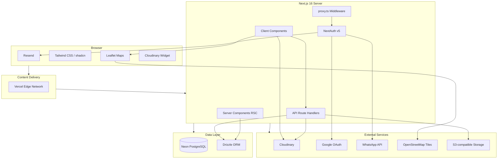
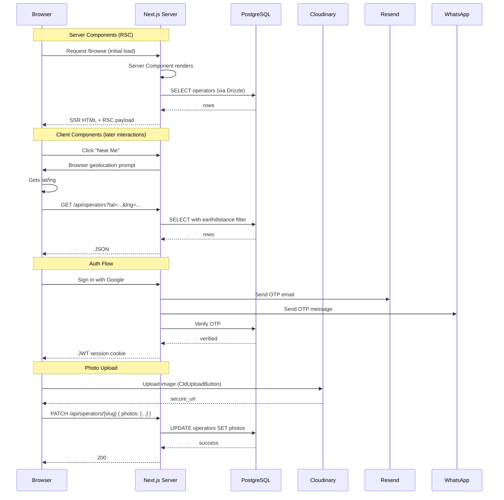
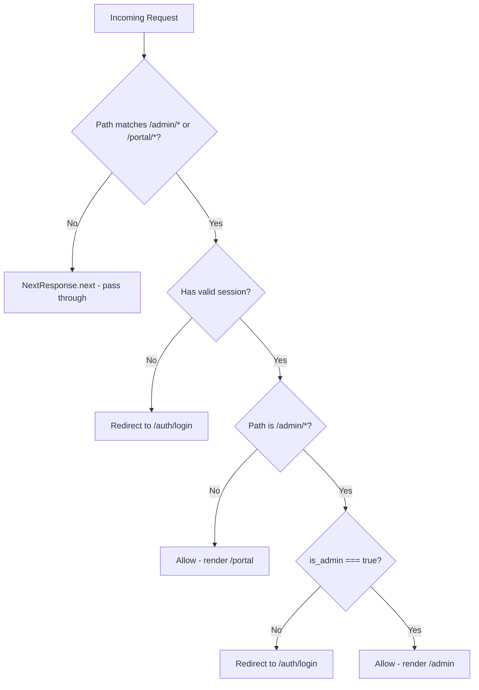
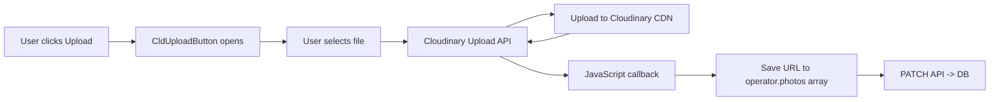
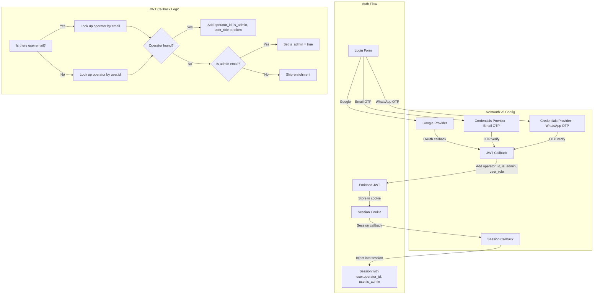
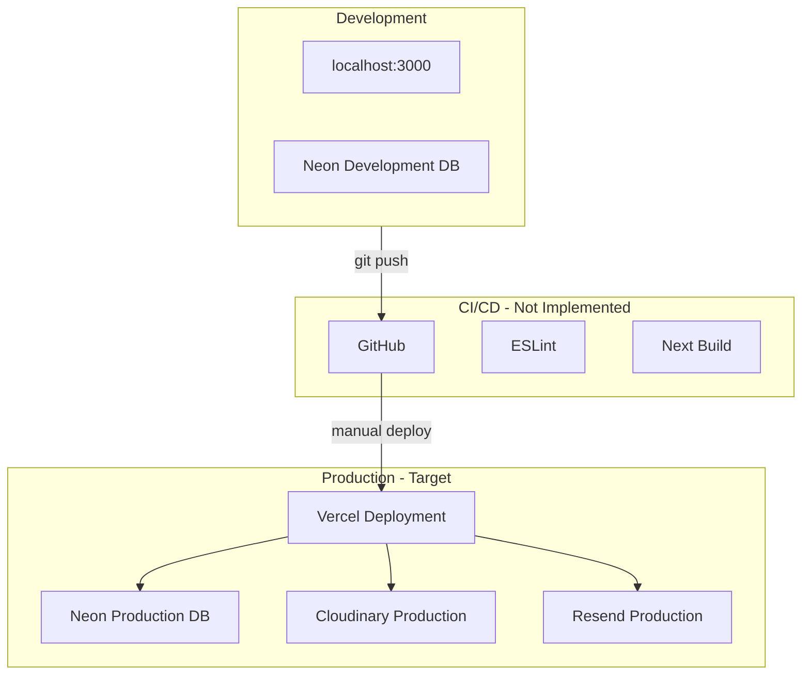

# System Architecture

## 1. High-Level Architecture



---

## 2. Component Architecture

```mermaid
graph TB
    subgraph App [App Router Pages]
        L[layout.tsx]
        LP[page.tsx - Landing]
        BR[browse/page.tsx]
        CT[category/page.tsx]
        OP[op/slug/page.tsx]
        JN[join/page.tsx]
        LG[auth/login/page.tsx]
        PO[portal/layout.tsx]
        PD[portal/page.tsx]
        PE[portal/edit/page.tsx]
        AD[admin/page.tsx]
        NF[not-found.tsx]
    end

    subgraph Components [Shared Components]
        BP[browse-page.tsx]
        OC[operator-card.tsx]
        OPR[operator-profile.tsx]
        SC[search-command.tsx]
        UI[ui/*.tsx - shadcn]
    end

    subgraph Lib [Library Layer]
        A[auth.ts]
        DB[db.ts]
        U[upload.ts]
        RE[resend.ts]
        UT[utils.ts]
        CO[constants.ts]
        WH[whatsapp.ts]
    end

    subgraph Types [Types]
        TY[index.ts]
    end

    subgraph DB [Database]
        SCHEMA[schema.ts]
        MIG[migrate.ts]
    end

    BR --> BP
    CT --> OC
    OP --> OPR
    JN --> A
    LG --> A
    PD --> A
    PD --> DB
    PE --> A
    PE --> DB
    PE --> U
    AD --> A
    AD --> DB

    BP --> OC
    BP --> UI
    OPR --> UI
    OPR --> WH

    A --> NA[NextAuth]
    A --> DZ[Drizzle]
    A --> RE
    DB --> DZ
    U --> CL[Cloudinary SDK]
    RE --> R[Resend SDK]

    SCHEMA --> DZ
    MIG --> NEON[@neondatabase/serverless]
```

---

## 3. Data Flow Pattern



---

## 4. Route Protection Architecture



**Implementation:** `src/proxy.ts`
- Runs as middleware (should be `middleware.ts` per Next.js convention — current filename may prevent automatic execution)
- Uses `matcher: ['/admin/:path*', '/portal/:path*']`
- Calls `auth()` (NextAuth) to get session
- For `/admin`: checks `session.user.is_admin === true`
- For `/portal`: checks `session` exists

**Client-side redundant checks:**
- `/admin` page re-checks `session?.user?.is_admin` in useEffect and redirects if not admin
- `/portal` layout re-checks session

---

## 5. State Management

**No global state library** (no Redux, Zustand, or Jotai). State is managed through:

| State Type | Mechanism |
|-----------|-----------|
| Server state | React Server Components (RSC) — direct DB access |
| Client state | React `useState`, `useEffect` |
| URL state | `useSearchParams` for browse filters |
| Session | NextAuth's `useSession()` hook (React Context) |
| Form state | Local component state |
| Toasts | Sonner (global toast context in root layout) |

---

## 6. File Upload Architecture



**Key Points:**
- Cloudinary widget (`CldUploadButton` from `next-cloudinary`) handles client-side upload
- No server-side upload processing
- URLs stored as TEXT[] array in `operators.photos`
- Backup S3 upload is INFERRED (env vars exist but no code path found)

---

## 7. Geospatial Search Architecture


**Performance:**
- GiST index on `ll_to_earth(lat, lng)` enables fast radius searches
- Index only works when both `lat` and `lng` are non-null
- Query pattern: `SELECT * FROM operators WHERE earth_distance(ll_to_earth(lat, lng), ll_to_earth($1, $2)) <= $3`

---

## 8. Session & Auth Architecture



---

## 9. Dependencies & Imports Map

```
src/app/page.tsx
  ├── next/link
  ├── lucide-react (icons)
  └── @/components/ui/*

src/components/browse-page.tsx
  ├── next/navigation (useSearchParams, useRouter)
  ├── react (useState, useEffect, useCallback)
  ├── @/lib/utils (cn)
  ├── @/components/operator-card
  ├── lucide-react
  └── sonner (toast)

src/components/operator-card.tsx
  ├── next/link
  ├── @/lib/utils (cn)
  ├── @/types
  └── lucide-react

src/components/operator-profile.tsx
  ├── next/navigation (useParams)
  ├── react (useState, useEffect)
  ├── @/lib/utils (cn)
  ├── @/lib/whatsapp
  ├── @/types
  ├── lucide-react
  ├── sonner
  ├── react-leaflet (MapContainer, TileLayer, Marker, Popup)
  └── leaflet (icon)

src/lib/auth.ts
  ├── next-auth/adapters
  ├── @auth/core (NextAuth v5 beta)
  ├── next-auth/providers/google
  ├── next-auth/providers/resend (INFERRED — or custom credentials)
  ├── @/lib/db (Drizzle instance)
  └── @/db/schema (operators table)

src/lib/db.ts
  ├── @neondatabase/serverless (neon)
  └── drizzle-orm/neon-http (drizzle)
```

---

## 10. Deployment Architecture



**Current State:**
- No CI/CD pipeline configured
- No Docker configuration
- Deployment is manual (vercel CLI or git push to Vercel)
- Development uses local `next dev` on port 3000
- Production target is Vercel (Next.js optimization is configured)
