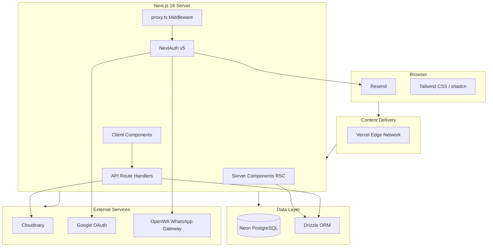
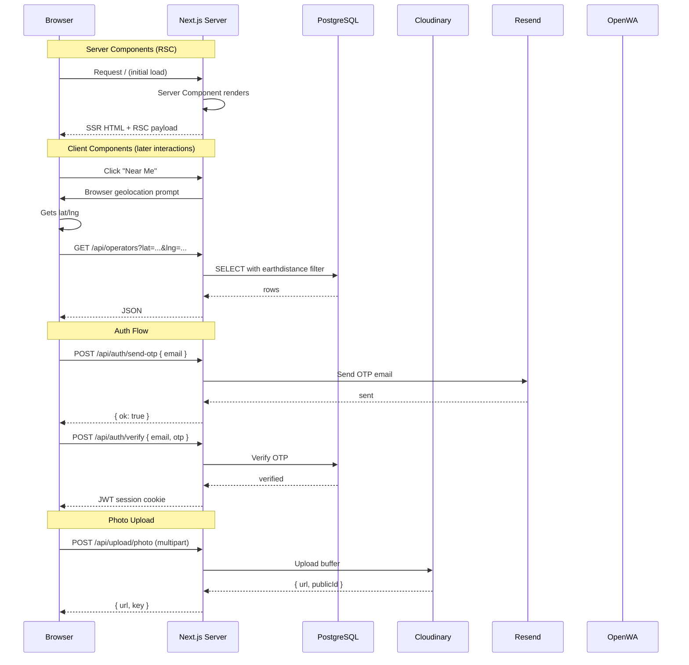
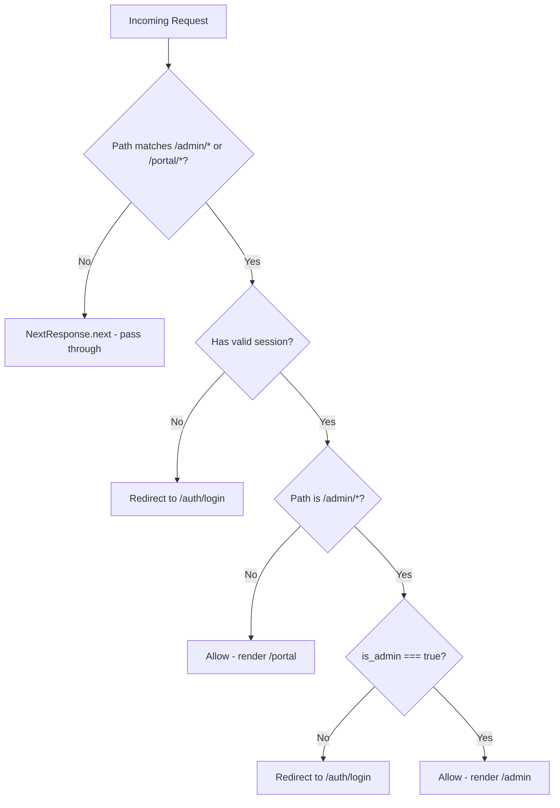
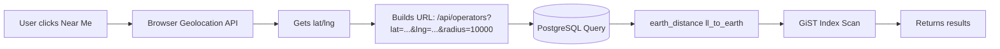
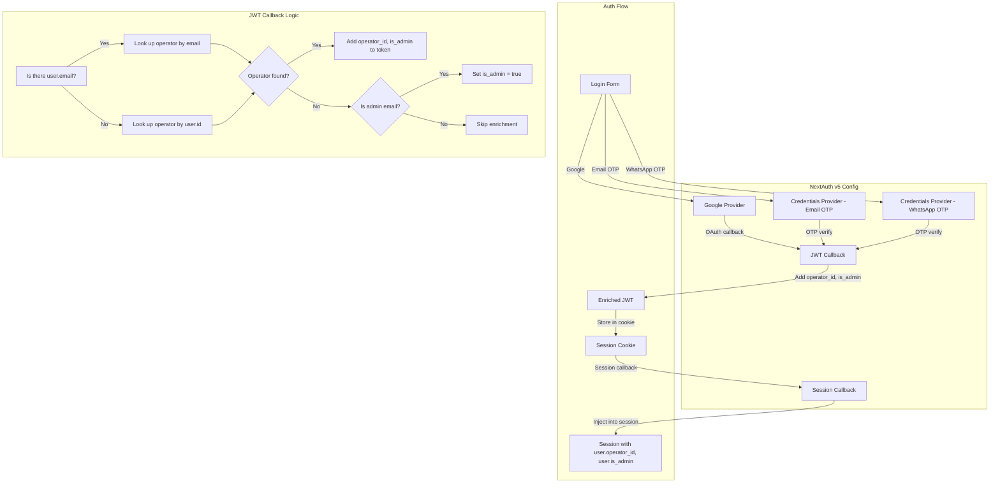
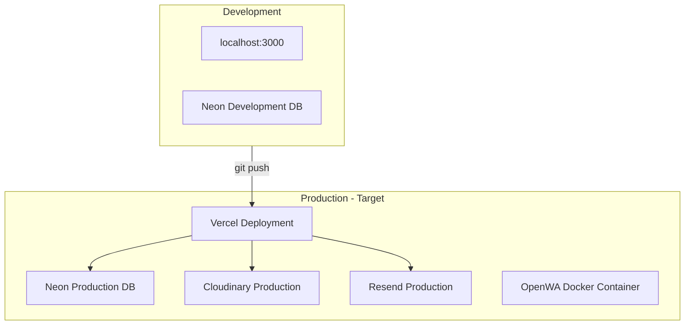

# System Architecture

## 1. High-Level Architecture



---

## 2. Component Architecture

```mermaid
graph TB
    subgraph App [App Router Pages]
        L[layout.tsx]
        HP[page.tsx - Browse Home]
        OP[o/slug/page.tsx]
        SP[search/page.tsx]
        FP[favorites/page.tsx]
        JN[join/page.tsx]
        LG[auth/login/page.tsx]
        PO[portal/layout.tsx]
        PD[portal/page.tsx]
        PE[portal/edit/page.tsx]
        AD[admin/page.tsx]
        AO[admin/operators/page.tsx]
        ADET[admin/operators/[id]/page.tsx]
        AC[admin/categories/page.tsx]
        NF[not-found.tsx]
    end

    subgraph Components [Shared Components]
        BP[browse-page.tsx]
        OC[operator-card.tsx]
        OPR[operator-profile.tsx]
        UI[ui/*.tsx - shadcn]
    end

    subgraph Lib [Library Layer]
        A[auth.ts]
        CL[cloudinary.ts]
        OW[openwa.ts]
        RE[resend.ts]
        S3[s3.ts]
        LOC[location.ts]
        GH[ghats.ts]
        UT[utils.ts]
    end

    subgraph Types [Types]
        TY[index.ts]
    end

    subgraph DB [Database]
        SCHEMA[schema.ts]
        MIG[migrate.ts]
    end

    HP --> BP
    OP --> OPR
    SP --> OC
    FP --> OC
    JN --> UT
    LG --> A
    PD --> A
    PE --> UT
    AD --> A

    BP --> OC
    BP --> UI
    OPR --> UI

    A --> NA[NextAuth]
    A --> DZ[Drizzle]
    RE --> R[Resend SDK]
    CL --> C[Cloudinary SDK]

    SCHEMA --> DZ
    MIG --> NEON[@neondatabase/serverless]
```

---

## 3. Data Flow Pattern



---

## 4. Route Protection Architecture



**Implementation:** `src/proxy.ts`
- Runs as middleware (file is `proxy.ts`, not `middleware.ts` — may need renaming per Next.js convention)
- Uses `matcher: ['/admin/:path*', '/portal/:path*']`
- Calls `auth()` (NextAuth) to get session
- For `/admin`: checks `session.user.is_admin === true`
- For `/portal`: checks `session` exists

---

## 5. State Management

**No global state library** (no Redux, Zustand, or Jotai). State is managed through:

| State Type | Mechanism |
|-----------|-----------|
| Server state | React Server Components (RSC) — direct DB access |
| Client state | React `useState`, `useEffect` |
| URL state | `useSearchParams` for browse filters |
| Session | NextAuth's `useSession()` hook (React Context) |
| Form state | Local component state |
| Toasts | Sonner (global toast context) |

---

## 6. File Upload Architecture

```mermaid
flowchart LR
    U[User clicks Upload] --> P[File input onChange]
    P --> C[Compress via browser-image-compression]
    C --> F[POST /api/upload/photo multipart/form-data]
    F --> N[Next.js API Route]
    N --> CL[Upload to Cloudinary]
    CL --> CLR[Return { url, publicId }]
    CLR --> S[Save URL to operator.photos array]
    S --> D[PATCH API -> DB]
```

**Key Points:**
- Upload via custom API route, not client-side widget
- Server validates MIME type (jpeg/png/webp) and size (max 5MB)
- Images compressed client-side before upload

---

## 7. Geospatial Search Architecture



**Performance:**
- GiST index on `ll_to_earth(lat, lng)` enables fast radius searches
- Index only works when both `lat` and `lng` are non-null

---

## 8. Session & Auth Architecture



---

## 9. Dependencies & Imports Map

```
src/app/page.tsx
  └── @/components/browse-page

src/components/browse-page.tsx
  ├── next/navigation (useSearchParams, useRouter)
  ├── react (useState, useEffect, useCallback)
  ├── @/lib/utils (cn)
  ├── @/components/operator-card
  ├── lucide-react
  └── sonner (toast)

src/components/operator-card.tsx
  ├── next/link
  ├── @/lib/utils (cn)
  ├── @/types
  └── lucide-react

src/components/operator-profile.tsx
  ├── next/navigation (useParams)
  ├── react (useState, useEffect)
  ├── @/lib/utils (cn)
  ├── @/types
  ├── lucide-react
  └── sonner

src/lib/auth.ts
  ├── @auth/core (NextAuth v5 beta)
  ├── next-auth/providers/google
  ├── @/db (Drizzle instance)
  └── @/db/schema (operators table)
```

---

## 10. Deployment Architecture



**Current State:**
- No CI/CD pipeline configured
- OpenWA WhatsApp gateway runs via Docker (`docker-compose.openwa.yml`)
- Deployment is manual (vercel CLI or git push to Vercel)
