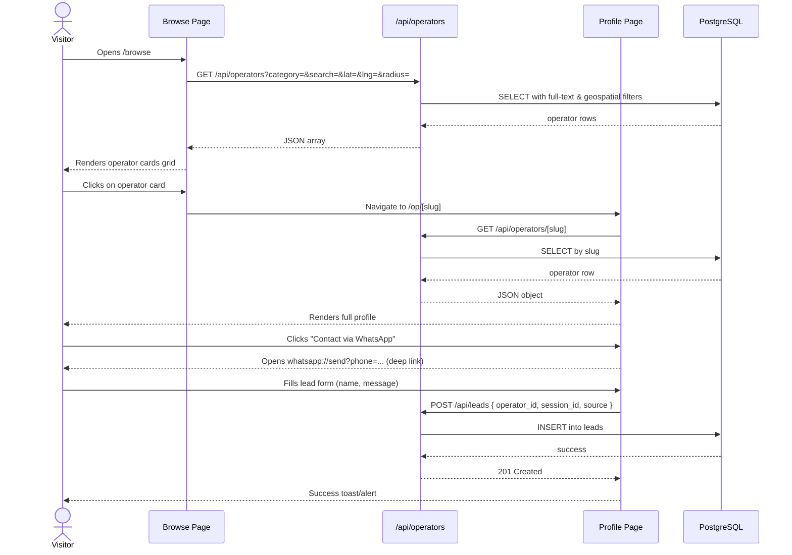
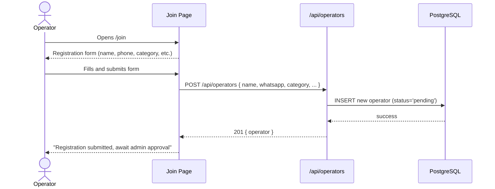
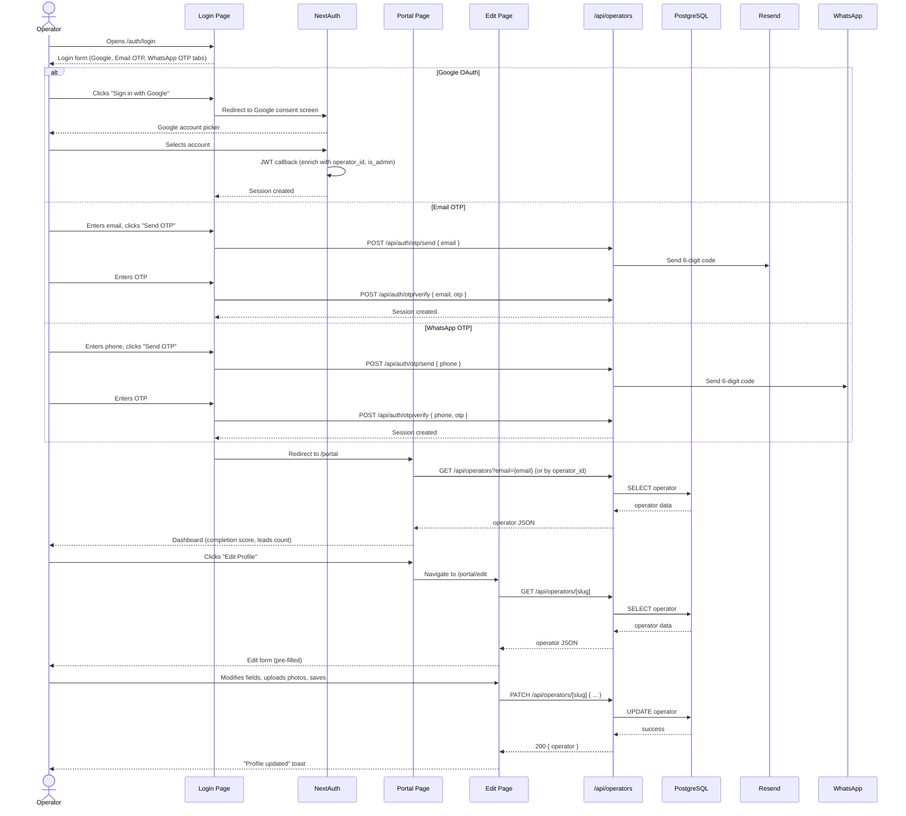
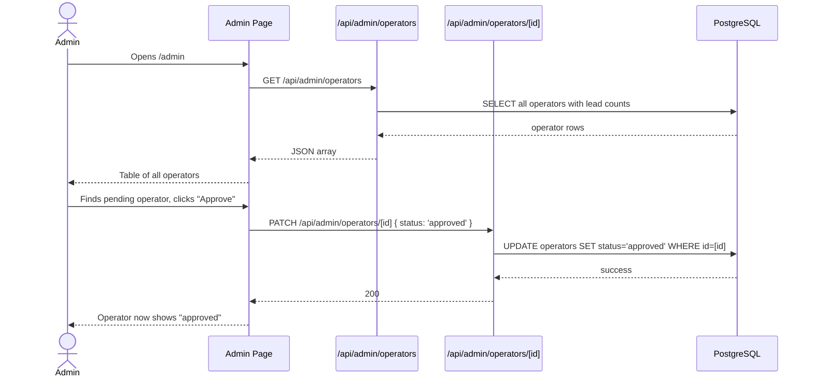
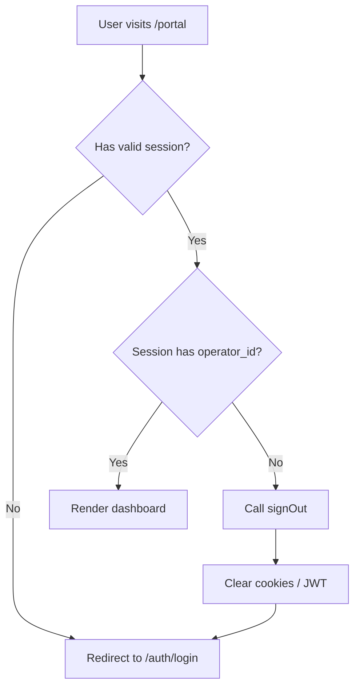
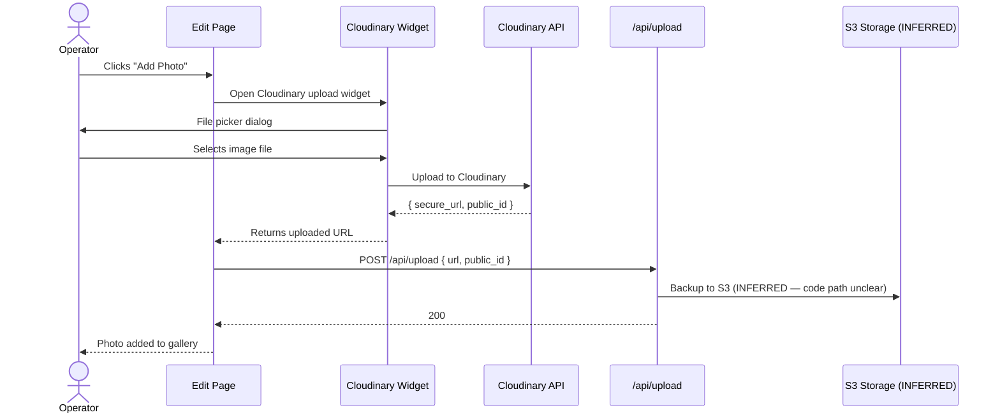
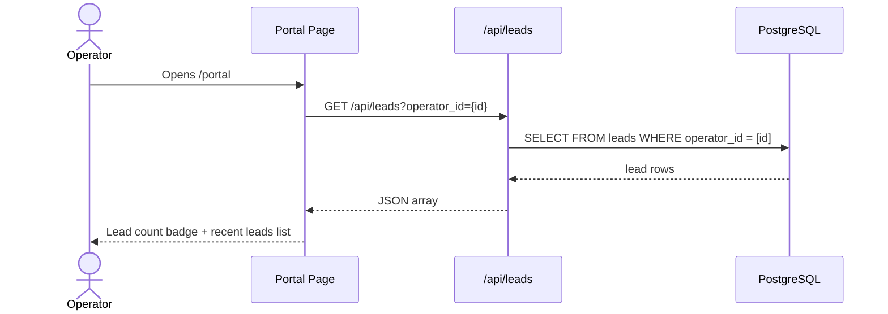
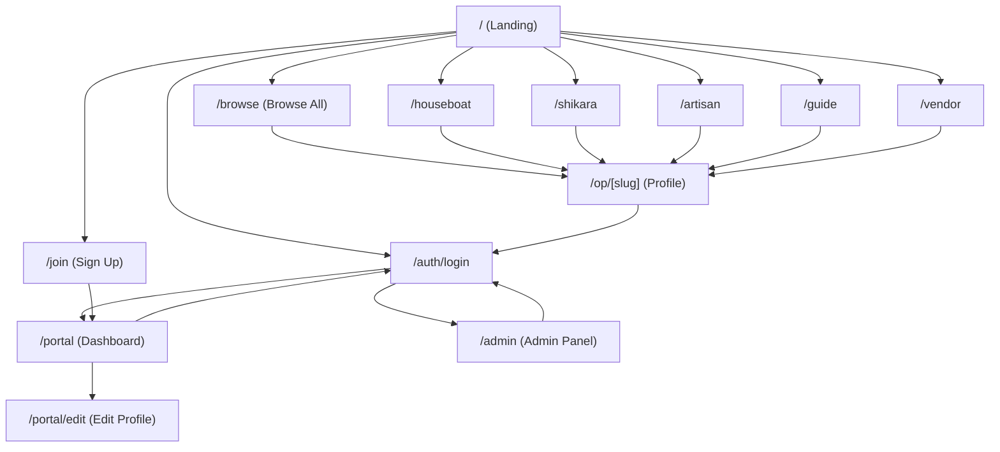
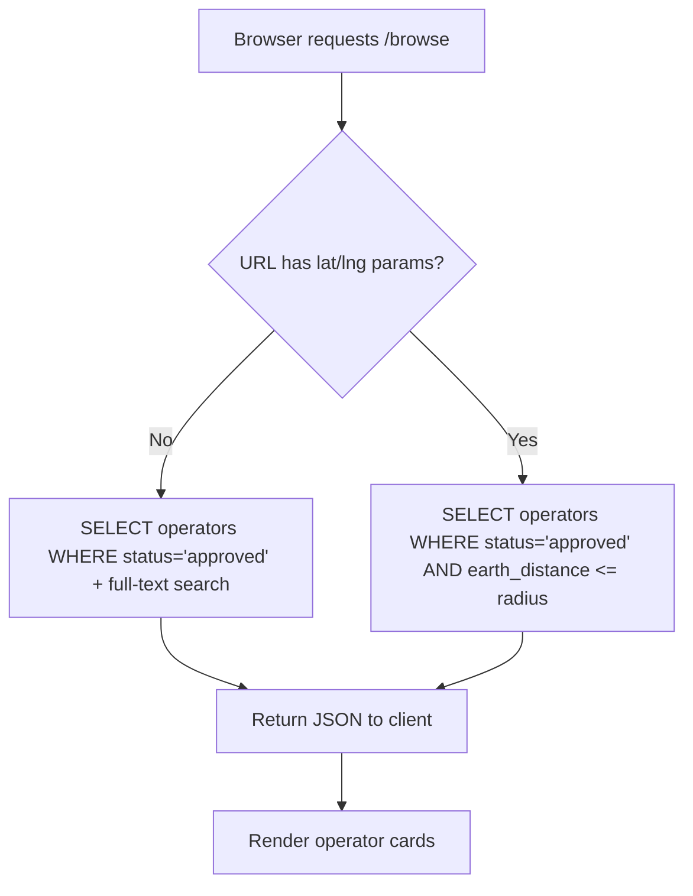

# User Flows

## 1. Visitor: Browse → Profile → Lead



## 2. Operator: Join



## 3. Operator: Login & Dashboard



## 4. Admin: Approve Operator



## 5. Session Validation (Stale Token Handling)



## 6. Category-Specific Profile Flow

```mermaid
flowchart TD
    A[Visitor opens /op/[slug]] --> B[Fetch operator data]
    B --> C{Category?}
    C -->|houseboat| D[Show houseboat_details section]
    C -->|shikara| E[Show shikara_details section]
    C -->|artisan| F[Show artisan_details section]
    C -->|guide| G[Show guide info]
    C -->|vendor| H[Show vendor info]
    D --> I[Show common sections: photos, contact, lead form]
    E --> I
    F --> I
    G --> I
    H --> I
```

## 7. Photo Upload Flow



## 8. Lead Viewing (Operator)



## 9. Full Site Map (Navigation Flow)



## 10. Data Flow: Browse with Geospatial Filtering


